# ROCK, PAPER, SCISSORS GAME - PP3
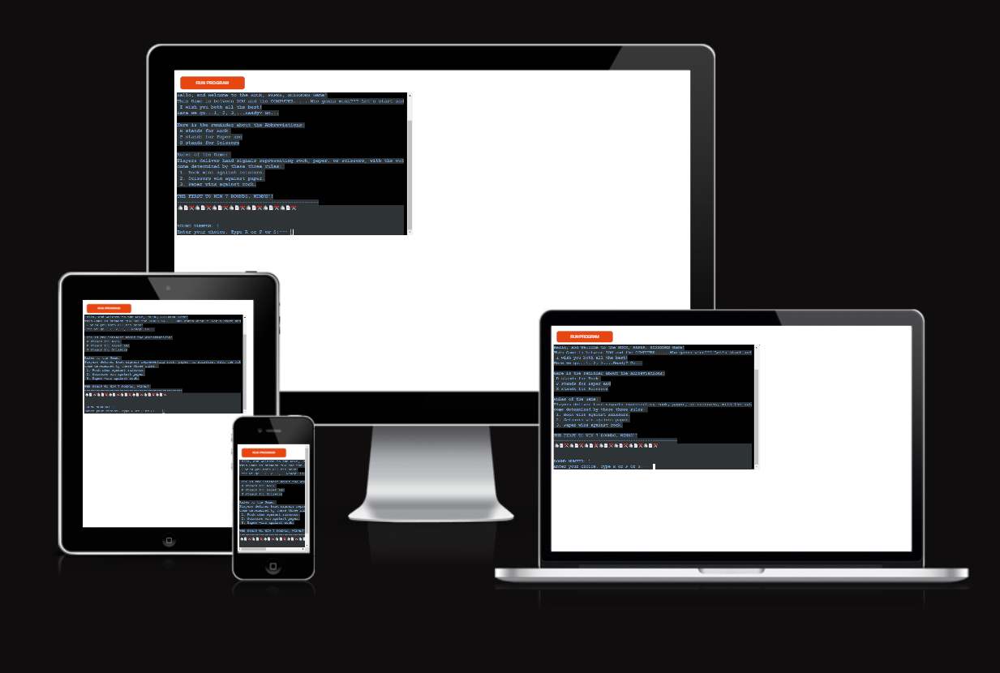

# TOC 

## Rock Paper Scissors Why Should You Play? 

Many people are often in the dark as to what the Rock Paper Scissors game offers its players. This is because they are ignorant of what the game is truly about and what comes with playing the game. Participants who have understood the concept of the game will agree that the game is a really interesting game that offers a lot of excitement. As a participant, you can play the game on a professional level or to catch fun. Either way, the game is opened to everyone. Learning how to play is not as hard as it looks, as long as you have the intention to learn and practice.

The truth is that you will find out that the game can be personalized. For instance, consider the individual benefits available in the process of learning and practicing, the skills and experience to be gained, and, most importantly, the level of professionalism to be attained. Additionally, the game can be played to drive a personal interest or purpose (for fun), which is one way the game offers flexibility.
###### credit goes to https://wrpsa.com/why-should-you-play-rock-paper-scissors/

## The Mind And Physical Exercise 
One beautiful thing about the Rock Paper Scissors game is that you can improve your wellbeing and lifestyle by merely playing the game, either informally or on a professional level. The game requires physical exertions such as extending hand gestures and standing (with little body movements) for a couple of minutes. Not only that, the mind is not left out in the equation. The game involves that you are mentally active. Some of the mental exertions include mind reading, strategic planning, and mind control.

All these combined will not only aid your performance but will also improve your personal life. Physical exercise will keep you physically fit and improve your muscles. Mental preparation helps you with focus, consciousness, concentration, and control of your mind. All these are the benefits you get to enjoy playing the Rock Paper Scissors game.
###### credit goes to https://wrpsa.com/why-should-you-play-rock-paper-scissors/
## Design (Pre Development) and Development Process
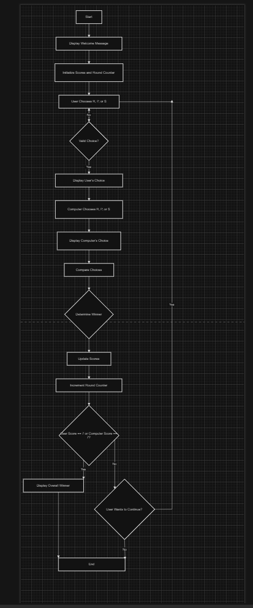
#### 1. Tell the user to chose R for Rock, or P for Paper or S for Scissors
##### 2. Get the user's Input
##### 3. Convert the users Input into capital letter (R, P and S)
##### 4. Validate Inputs from the users and print an error if Invalid (Invalid are all choices different from R, P and S)
##### 5. Computer's choice ( this will be a random choice from the R, P, S)
##### 6. Compare the choice of the user and of the computer
##### 7. print the choices
##### 8. Determine the winner round by comparring the choices according the Games Rules
##### 9. ask the user if they want to continue playing
##### 10. if NOT, terminate the Game, other wise continue
##### 11. Declare the ultimate winner (who won 7 rounds first)

## Features 
### from developer perspective
* Input / Output Features
    * 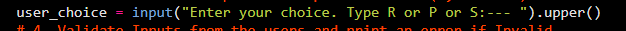
    * 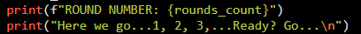
* User Input validations and Error Handling
    * 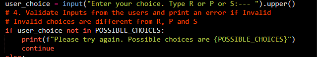
* While Loops
    * 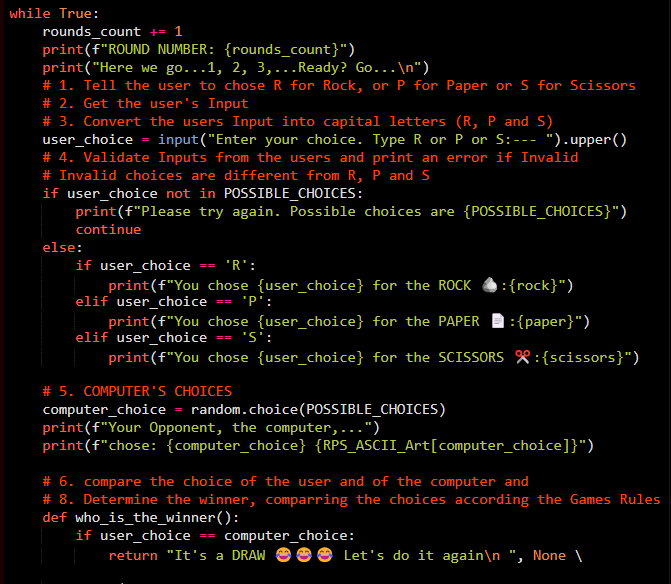
* Conditionals (if statements)
    * 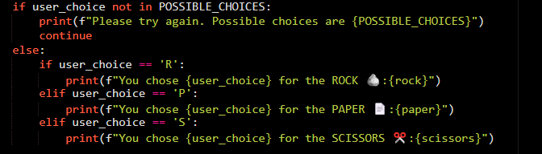
* Random 
    * 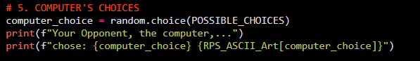

### from user perspective
* Rounds count
    * 
    * 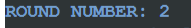
* Visuals
    * 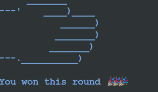
    * 

* Instant Feedbacks
    * 
    * 

* User is able to terminate the game prematurely
    * 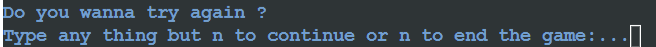

* Game terminates automatically also after one wins 7 rounds before the other rounds
    * 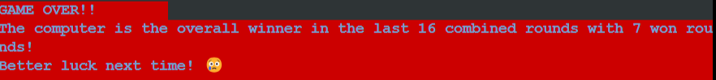
* Score tracking
    * 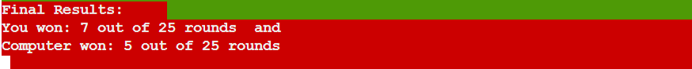

## Technologies Used
### Resources

- Gitpod
- Visual Studio Code (VSC)
- GitHub 
- Heroku
### Libraries
#### color 
- colorama==0.4.6
- colored==2.2.4
- termcolor==2.5.0
[random](https://docs.python.org/3/library/random.html) - to generate contrast colors in the python terminal

## Testing
Once the portal was operational I set about testing it for errors and to ensure any possible errors that can be made were caught.
I have also tested manually for work as follow:
* Passed the code through a PEP8 Linter and confirmed there are no errors
* I have given invalid inputs (numbers, strings different to what's expected etc) and the project is able to catch those errors without craching
* I have tested my Gitpod local terminal as well as the heroku terminal and all is working as expected
* An example of the tests done can be found here: [TESTING.md](testing/TESTING.md)
## Validations Testing
* PEP8 Python Validator
* 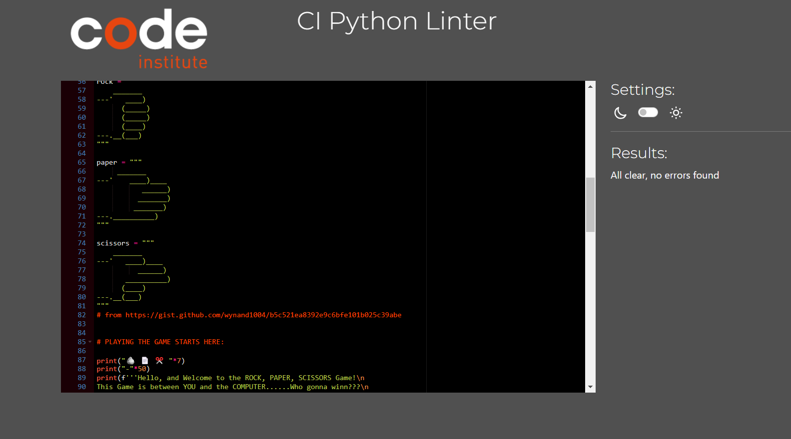
## Deployment
### Heroku
The Application has been deployed from GitHub to Heroku by following the steps:

1. Created and loged in to my account at heroku.com
2. Created a new app, added a unique app name (Rock-Paper-Scissors-Game-PP3) and then chose the region
3. Clicked on create app
4. Go to "Settings"
5. Under Config Vars, no extra key(s) and Values were added as I have no API used in my project.
6. Add required buildpacks (further dependencies). For this project, it is set up that Python is on top and Node.js on bottom
7. Go to "Deploy" and select "GitHub" in "Deployment method"
8. To connect Heroku app to my Github repository code, I entered the repository name, clicked 'Search' and then 'Connect' when it showed below.
9.  Chose the branch I want to build my app from (Main in my case)
10. then I did "Enable Automatic Deploys", which keeps the app up to date with my GitHub repository
11. Waited for the app to build. Once ready I could see the “App was successfully deployed” message and a 'View' button to take me to the deployed link.

The deployed project live link is [HERE](https://rock-paper-scissors-game-pp3-322472c99019.herokuapp.com/) - ***Use Ctrl (Cmd) and click to open in a new window.*** 

### Gitpod / Github / 
* The Project code is reposted on GitHub
#### Bugs
###### Solved Bugs
During development, i got bugs related to the python syntax, for example, when I was validating the code in the CI Python Linter, errors due to "Too  Long line with length greater than 79"
I solved those error by breaking those lines into more lines or using \ and \n
###### Remaining known Bugs
* When trying to validate the project with WAVE accessibility tool, I got a contrast error caused by the the RUN PROGRAM button
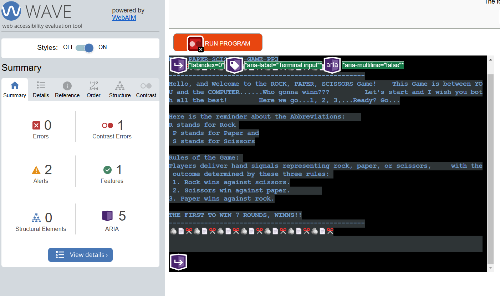 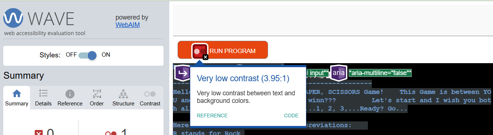. This is out od my project scope as this button is from heroku.
* The Terminal is so small and not user friendly (This is beyond the scope of my Project at the moment)
* I tried on my phone and couldn't play the game
* 
## Future Updates
- Using the game to decide between participants for a specific task. For instance, used between siblings to decide who clears the table or trims the garden. Colleagues can also play the game to decide who pays the bill for lunch.

- Add an option for two players to play against each other, taking turns to input
their choices. The program should then determine the winner based on their
inputs. 
- Creating a multiplayer RPS game to involve more than the regular numbers of participants

## Credits and Aknowledgements
The followig sources have inspired some though on how to think about this project and some portions of their code might have been borrowed/used:

1. I have used the RPS_ASCII_Art code https://gist.github.com/wynand1004/b5c521ea8392e9c6bfe101b025c39abe for the image kind of art for the rock paper and scissors.

2. Code Institute especially the love sandwiches project walkthrough
3. Angela Yu, (Course: [Master Python by building 100 projects in 100 days. Learn data science, automation, build websites, games and apps!](https://www.udemy.com/course/100-days-of-code/?couponCode=24T3MT120924))
4. Mosh Hamadani (youtunbe: [Python Projects for Beginners – Master Problem-Solving!](https://www.youtube.com/watch?v=yVl_G-F7m8c) )
5. My Mentor (https://www.linkedin.com/in/jubrillionaire/)
6. World of Rock Paper Scissors (RPS) website: https://wrpsa.com/

<!--
Code Institute's Read Me file:

Welcome,

This is the Code Institute student template for deploying your third portfolio project, the Python command-line project. The last update to this file was: **May 14, 2024**

## Reminders

- Your code must be placed in the `run.py` file
- Your dependencies must be placed in the `requirements.txt` file
- Do not edit any of the other files or your code may not deploy properly

## Creating the Heroku app

When you create the app, you will need to add two buildpacks from the _Settings_ tab. The ordering is as follows:

1. `heroku/python`
2. `heroku/nodejs`

You must then create a _Config Var_ called `PORT`. Set this to `8000`

If you have credentials, such as in the Love Sandwiches project, you must create another _Config Var_ called `CREDS` and paste the JSON into the value field.

Connect your GitHub repository and deploy as normal.

## Constraints

The deployment terminal is set to 80 columns by 24 rows. That means that each line of text needs to be 80 characters or less otherwise it will be wrapped onto a second line.

---

Happy coding!
--->