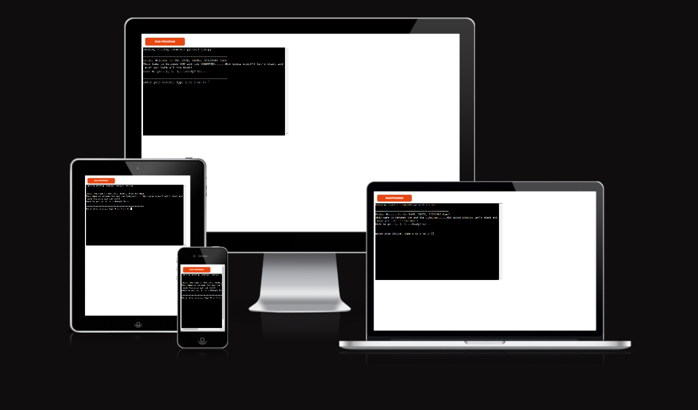

# ROCK, PAPER, SCISSORS GAME - PP3

The deployed project live link is [HERE](https://rock-paper-scissors-game-pp3-322472c99019.herokuapp.com/) - ***Use Ctrl (Cmd) and click to open in a new window.*** 

### Resources

- Gitpod
- Visual Studio Code (VSC)
- GitHub 
- Heroku
### Next Improvement Backlog
- Add an option for two players to play against each other, taking turns to input
their choices. The program should then determine the winner based on their
inputs. 

### Credits
The followig sources have inspired some though on how to think about this project and some portions of their code might have been borrowed/used:

1. I have used the RPS_ASCII_Art code https://gist.github.com/wynand1004/b5c521ea8392e9c6bfe101b025c39abe for the image kind of art for the rock paper and scissors.

2. Code Institute especially the love sandwiches project walkthrough
3. Angela Yu, (Course: [Master Python by building 100 projects in 100 days. Learn data science, automation, build websites, games and apps!](https://www.udemy.com/course/100-days-of-code/?couponCode=24T3MT120924))
4. Mosh Hamadani (youtunbe: [Python Projects for Beginners – Master Problem-Solving!](https://www.youtube.com/watch?v=yVl_G-F7m8c) )
5. My Mentor (https://www.linkedin.com/in/jubrillionaire/)
6. World of Rock Paper Scissors (RPS) website: https://wrpsa.com/

<!--
Code Institute's Read Me file:

Welcome,

This is the Code Institute student template for deploying your third portfolio project, the Python command-line project. The last update to this file was: **May 14, 2024**

## Reminders

- Your code must be placed in the `run.py` file
- Your dependencies must be placed in the `requirements.txt` file
- Do not edit any of the other files or your code may not deploy properly

## Creating the Heroku app

When you create the app, you will need to add two buildpacks from the _Settings_ tab. The ordering is as follows:

1. `heroku/python`
2. `heroku/nodejs`

You must then create a _Config Var_ called `PORT`. Set this to `8000`

If you have credentials, such as in the Love Sandwiches project, you must create another _Config Var_ called `CREDS` and paste the JSON into the value field.

Connect your GitHub repository and deploy as normal.

## Constraints

The deployment terminal is set to 80 columns by 24 rows. That means that each line of text needs to be 80 characters or less otherwise it will be wrapped onto a second line.

---

Happy coding!
--->