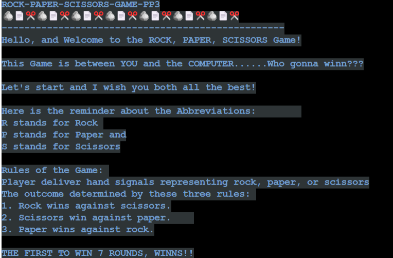
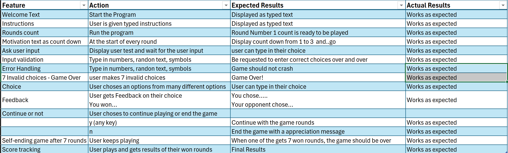

# ROCK, PAPER, SCISSORS GAME - PP3

[**Click here to see the live page**](https://rock-paper-scissors-game-pp3-322472c99019.herokuapp.com/)

## Why Should You Play? 

Many people are often in the dark as to what the Rock Paper Scissors game offers its players. This is because they are ignorant of what the game is truly about and what comes with playing the game. Participants who have understood the concept of the game will agree that the game is a really interesting game that offers a lot of excitement. As a participant, you can play the game on a professional level or to catch fun. Either way, the game is opened to everyone. Learning how to play is not as hard as it looks, as long as you have the intention to learn and practice.

The truth is that you will find out that the game can be personalized. For instance, consider the individual benefits available in the process of learning and practicing, the skills and experience to be gained, and, most importantly, the level of professionalism to be attained. Additionally, the game can be played to drive a personal interest or purpose (for fun), which is one way the game offers flexibility.
###### credit goes to https://wrpsa.com/why-should-you-play-rock-paper-scissors/

## The Mind And Physical Exercise 
One beautiful thing about the Rock Paper Scissors game is that you can improve your wellbeing and lifestyle by merely playing the game, either informally or on a professional level. The game requires physical exertions such as extending hand gestures and standing (with little body movements) for a couple of minutes. Not only that, the mind is not left out in the equation. The game involves that you are mentally active. Some of the mental exertions include mind reading, strategic planning, and mind control.

All these combined will not only aid your performance but will also improve your personal life. Physical exercise will keep you physically fit and improve your muscles. Mental preparation helps you with focus, consciousness, concentration, and control of your mind. All these are the benefits you get to enjoy playing the Rock Paper Scissors game.
###### credit goes to https://wrpsa.com/why-should-you-play-rock-paper-scissors/
## Design (Pre Development) and Development Process

#### 1. Tell the user to chose R for Rock, or P for Paper or S for Scissors
##### 2. Get the user's Input
##### 3. Convert the users Input into capital letter (R, P and S)
##### 4. Validate Inputs from the users and print an error if Invalid (Invalid are all choices different from R, P and S)
##### 5. Computer's choice ( this will be a random choice from the R, P, S)
##### 6. Compare the choice of the user and of the computer
##### 7. print the choices
##### 8. Determine the winner round by comparring the choices according the Games Rules
##### 9. ask the user if they want to continue playing
##### 10. if NOT, terminate the Game, other wise continue
##### 11. Declare the ultimate winner (who won 7 rounds first)

## Features 
### from developer perspective
#### Instruction Section on the main page
* This contains a welcome message, explanation on how to play the game and the rules of the game
* 

* Input / Output Features
    * The user is given opportunity to give or chose a letter (R for rock, P for Paper or S for scissors)
    * The user is guided into doing that choice through a printed out text
    * 
    * 
    * 

* User Input validations and Error Handling
    * It is possible that the user will give invalid input, meaning (not R, P or S)
    * Therefore, all user input is checked to see if the user choice is in the tuple called POSSIBLE_CHOICES
    * if not in that tuple, a grcefull message to try again is displayed to the user and asks the user to try again
    * 
    * 
* While Loops
    * This loop makes it possible for the game to keep going until the defined conditions are met
    * the game will for instance keep going until one of the player gets 7 scores before the other player
    * the game will end automatically if the user gives in invalid input seven consective times
    * 
* Conditionals (if statements)
    * The if satements to check conditions and count the rounds and the invalid inputs
    * 
* Random 
    * This is for the computer to be able to randomly chose from the tuple of possible choices
    * 

### from user perspective
* Rounds count
    * Shows the user how many rounds tried.
    * 
    * 
* Visuals
    * 
    * 

* Instant Feedbacks
    * The Games gives instant feedback to the user through printed text or through conditions met
    * 
    * 

* User is able to terminate the game prematurely
    * 

* Game terminates automatically also after one wins 7 rounds before the other rounds
    * 
* Score tracking
    * 

## Tools and Technologies Used
### Resources

- Gitpod - Code editor
- Visual Studio Code (VSC)
- GitHub  - to store code online
- Heroku - to deploy the app
### Libraries Imports
#### color 
I have imported the following libraries as i wanted to change colors of my terminal. Please note that all are not used in the code as of now.
- colorama==0.4.6
- colored==2.2.4
- termcolor==2.5.0
#### Random
used to randomly select computer choices from the POSSIBLE CHOICES tuple.
[random](https://docs.python.org/3/library/random.html) - to generate contrast colors in the python terminal

## VERSION CONTROL
* Git 

    Code has been pushed with git commands to remote repository on Github with commands:
   * git add . - to add files ready to commit
   * git commit -m "message" - to commit the code to local 
    repository ready to be pushed
  * git push - final command used to push commited code to remote repo on Github

## Testing
Once the portal was operational I set about testing it for errors and to ensure any possible errors that can be made were caught.
I have also tested manually for work as follow:
* Passed the code through a PEP8 Linter and confirmed there are no errors
* I have given invalid inputs (numbers, strings different to what's expected etc) and the project is able to catch those errors without craching
* I have tested my Gitpod local terminal as well as the heroku terminal and all is working as expected
* An example of the tests done can be found here: [TESTING.md](testing/TESTING.md)

## Validations Testing
* PEP8 Python Validator
* 

#### Bugs
###### Solved Bugs
+ During the development, i found that a user could keep entering invalid choices and the loop would indefinately continue. I solved that by keeping track of the invalid choices the user makes and ending the game after the 7th invalid choice
* During development, i got bugs related to the python syntax, for example, when I was validating the code in the CI Python Linter, errors due to "Too  Long line with length greater than 79 (constraint of 80)"
I solved those error by breaking those lines into more lines or using \ and \n

###### Remaining known Bugs
* When trying to validate the project with WAVE accessibility tool, I got a contrast error caused by the the RUN PROGRAM button
 . This is out of my project scope as this button is from heroku. And this project is mainly not concerned with the UI as is to run in the terminal.
* The Terminal is so small and not user friendly (This is a known constraint and is beyond the scope of my Project at the moment)
* I tried on my phone and couldn't play the game

## Functional Testing
* 

## Deployment
### Heroku
The Application has been deployed from GitHub to Heroku by following the steps:
+ Use: `pip freeze > requirements.txt` to add external libraries to deployed app.
+ Created and loged in to my account at heroku.com
+ Created a new app, added a unique app name (Rock-Paper-Scissors-Game-PP3) and then chose the region
+ Clicked on create app
+ Go to "Settings"
+ Under Config Vars, no extra key(s) and Values were added as I have no API used in my project.
+ Add required buildpacks (further dependencies). For this project, it is set up that Python is on top and Node.js on bottom
+ Go to "Deploy" and select "GitHub" in "Deployment method"
+ To connect Heroku app to my Github repository code, I entered the repository name, clicked 'Search' and then 'Connect' when it showed below.
+  Chose the branch I want to build my app from (Main in my case)
+ then I did "Enable Automatic Deploys", which keeps the app up to date with my GitHub repository
+ Waited for the app to build. Once ready I could see the “App was successfully deployed” message and a 'View' button to take me to the deployed link.

The deployed project live link is [HERE](https://rock-paper-scissors-game-pp3-322472c99019.herokuapp.com/) - ***Use Ctrl (Cmd) and click to open in a new window.*** 

### Gitpod / Github  
* The Project code is reposted on GitHub [HERE](https://github.com/Vinsengi/Rock-Paper-Scissors-Game-PP3)

## Future Updates
- Using the game to decide between participants for a specific task. For instance, used between siblings to decide who clears the table or trims the garden. Colleagues can also play the game to decide who pays the bill for lunch.

- Add an option for two players to play against each other, taking turns to input
their choices. The program should then determine the winner based on their
inputs. 
- Creating a multiplayer RPS game to involve more than the regular numbers of participants

## Cloning the Repository

1. On Github navigate to repository
2. Click "Code" a green button shown right above the file list
3. Copy the URL of the repo using HTTPS, SSH OR Github CLI
4. Open Git Bash
5. Change the current working directory to the location where you want the cloned directory
6. Type git clone, and then paste the URL you copied earlier
7. Press enter to create local Clone

For more details on how to clone the remote repo in order to create a local copy for own use, please go to 
https://docs.github.com/en/repositories/creating-and-managing-repositories/cloning-a-repository

## Forking
1. On Github navigate to repository
2. click "Fork" located towards the top right corner
3. Select "owner" for the forked repo, from the dropdown menu under "owner" Under "Owner"
4. It will create forked repo under the same name as orinial by default but you can type a name in "Repository name" or add a description in "Description" box.
5. Click "Create fork" !

Forking allows you to make any changes without affecting original project. You can send the suggestions over by submitting pull request. Project owner can review the pull request before accepting the suggestions and merging them.

For more details on how to fork the repo, in order to for example suggest any changes to the project you can visit: 
https://docs.github.com/en/get-started/quickstart/fork-a-repo

When you have fork to a repository you don't have access to files locally on your device, for this you will need to clone the forked repo.

## Credits and Aknowledgements
The followig sources have inspired some though on how to think about this project and some portions of their code might have been borrowed/used:

1. I have used the RPS_ASCII_Art code https://gist.github.com/wynand1004/b5c521ea8392e9c6bfe101b025c39abe for the image kind of art for the rock paper and scissors.

2. Code Institute especially the love sandwiches project walkthrough
3. Angela Yu, (Course: [Master Python by building 100 projects in 100 days. Learn data science, automation, build websites, games and apps!](https://www.udemy.com/course/100-days-of-code/?couponCode=24T3MT120924))
4. Mosh Hamadani (youtunbe: [Python Projects for Beginners – Master Problem-Solving!](https://www.youtube.com/watch?v=yVl_G-F7m8c) )
5. My Mentor for advices and sample readme templates (https://www.linkedin.com/in/jubrillionaire/)
6. World of Rock Paper Scissors (RPS) website: https://wrpsa.com/
7. Daisy Mc Girr for a great peer review and sample readme template (https://www.linkedin.com/in/mcgirr-daisy)

<!--
Code Institute's Read Me file:

Welcome,

This is the Code Institute student template for deploying your third portfolio project, the Python command-line project. The last update to this file was: **May 14, 2024**

## Reminders

- Your code must be placed in the `run.py` file
- Your dependencies must be placed in the `requirements.txt` file
- Do not edit any of the other files or your code may not deploy properly

## Creating the Heroku app

When you create the app, you will need to add two buildpacks from the _Settings_ tab. The ordering is as follows:

1. `heroku/python`
2. `heroku/nodejs`

You must then create a _Config Var_ called `PORT`. Set this to `8000`

If you have credentials, such as in the Love Sandwiches project, you must create another _Config Var_ called `CREDS` and paste the JSON into the value field.

Connect your GitHub repository and deploy as normal.

## Constraints

The deployment terminal is set to 80 columns by 24 rows. That means that each line of text needs to be 80 characters or less otherwise it will be wrapped onto a second line.

---

Happy coding!
--->